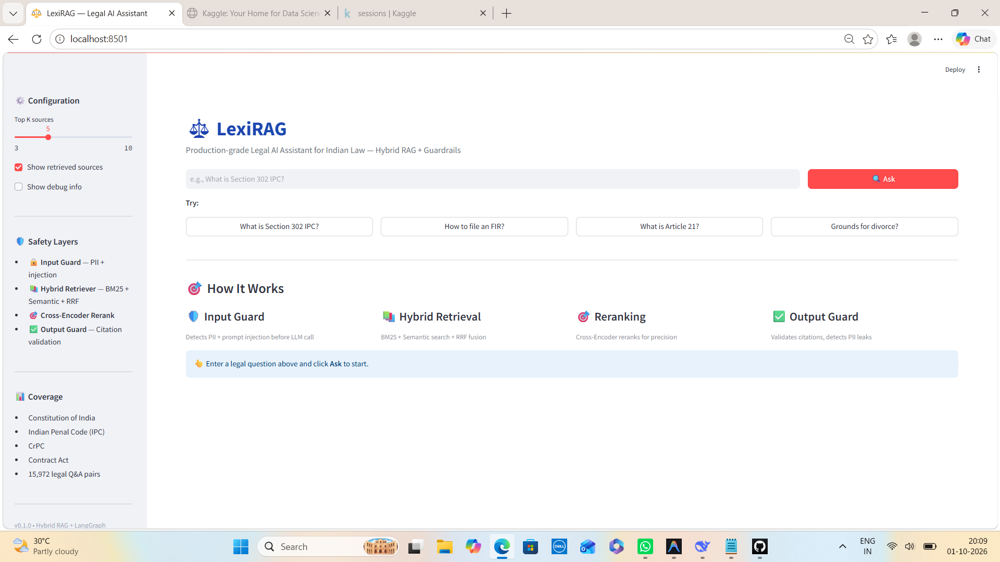

<div align="center">

# ⚖️ LexiRAG

### AI-Powered Legal Research Assistant for Indian Law

**Hybrid RAG + Guardrails + LangGraph orchestration with grounded citations, PII protection, prompt-injection detection, and adversarial output validation.**

<p>
  
  
  
  
  
  
  
</p>

<p>
  <a href="#-quick-start">Quick Start</a> •
  <a href="#-architecture">Architecture</a> •
  <a href="#-features">Features</a> •
  <a href="#-evaluation">Evaluation</a> •
  <a href="#-interview-talking-points">Interview</a>
</p>

</div>

---

## 📌 Overview

**LexiRAG** is an AI-powered legal research assistant focused on Indian legal texts.

It combines:

* 🔎 **Hybrid retrieval** using BM25 + semantic search
* 🎯 **Cross-Encoder reranking**
* 🧠 **RAG-based answer generation**
* 🛡️ **Input and output guardrails**
* 🔐 **PII detection and anonymization**
* 🚫 **Prompt-injection detection**
* 📚 **Citation validation**
* 🔄 **LangGraph-based conditional workflows**
* 📊 **Confidence-aware retrieval and self-correction**

The system is designed around an important principle:

> **Legal AI should ground its responses in retrieved legal sources instead of relying only on an LLM's internal knowledge.**

The project uses a legal dataset containing **15,972 deduplicated pairs** covering multiple Indian legal domains.

---

# 🎯 Problem

Legal question answering introduces several retrieval and reliability challenges.

### 1. Exact legal references are difficult for semantic search

A query such as:

```text
What is Section 302 IPC?
```

contains an important exact identifier: **302**.

Pure semantic retrieval can retrieve conceptually related sections even when the exact section number is important.

### 2. LLM-generated citations require validation

An LLM may generate a legal reference that does not exist in the retrieved context.

LexiRAG therefore validates generated section/article references against retrieved evidence.

### 3. Sensitive information may appear in user queries

Legal queries can contain:

* Aadhaar numbers
* PAN numbers
* Phone numbers
* Email addresses

LexiRAG detects and anonymizes these before the query reaches the LLM.

### 4. Prompt injection can manipulate an LLM

The system detects multiple prompt-injection patterns and can terminate the workflow before the LLM is called.

These challenges and their corresponding mitigation strategies are explicitly part of the project design.

---

# 💡 Solution

LexiRAG combines multiple techniques into a single guarded RAG pipeline:

```text
                    USER QUESTION
                          │
                          ▼
                ┌──────────────────┐
                │  INPUT GUARDRAIL │
                │                  │
                │ • Injection      │
                │ • PII Detection  │
                │ • Anonymization  │
                └────────┬─────────┘
                         │
                         ▼
                ┌──────────────────┐
                │ HYBRID RETRIEVER │
                │                  │
                │ BM25 + Semantic  │
                │       ↓          │
                │   RRF Fusion     │
                └────────┬─────────┘
                         │
                         ▼
                ┌──────────────────┐
                │ CROSS-ENCODER    │
                │    RERANKER      │
                │                  │
                │   Top 20 → Top 5 │
                └────────┬─────────┘
                         │
                         ▼
                ┌──────────────────┐
                │    GROQ LLM      │
                │                  │
                │ Llama 3.3 70B    │
                └────────┬─────────┘
                         │
                         ▼
                ┌──────────────────┐
                │ OUTPUT GUARDRAIL │
                │                  │
                │ • Citation Check │
                │ • PII Leak Check │
                │ • Toxicity Check │
                └────────┬─────────┘
                         │
                         ▼
                ┌──────────────────┐
                │ ANSWER + SOURCES │
                │ + CONFIDENCE     │
                └──────────────────┘
```

LangGraph controls the workflow through conditional routing, including early termination for blocked inputs and a retry path for low-confidence retrieval.

---

# ✨ Features

## 🛡️ 1. Multi-Layer Guardrails

LexiRAG uses separate protections before and after LLM generation.

| Layer               | Purpose                           | Action                          |
| ------------------- | --------------------------------- | ------------------------------- |
| 🛡️ Input Injection | Detect prompt-injection patterns  | Block request                   |
| 🔐 Input PII        | Detect sensitive Indian PII       | Anonymize                       |
| 📚 Output Citation  | Validate legal references         | Check against retrieved context |
| 🚨 Output Safety    | Detect potentially unsafe content | Flag for review                 |

The source implementation describes 11+ injection patterns and detection for Aadhaar, PAN, phone numbers, and email addresses.

---

# 🔎 2. Hybrid Retrieval

Instead of relying on only one retrieval strategy, LexiRAG combines:

### BM25

Useful for:

* Exact section numbers
* Legal terminology
* Names
* Keywords
* Structured identifiers

### Semantic Retrieval

Uses:

```text
sentence-transformers
        ↓
all-MiniLM-L6-v2
        ↓
384-dimensional embeddings
        ↓
ChromaDB
```

Semantic search helps retrieve documents based on conceptual similarity.

### Reciprocal Rank Fusion

BM25 and semantic results are combined using **RRF — Reciprocal Rank Fusion**.

```text
              Query
                │
        ┌───────┴────────┐
        ▼                ▼
      BM25          Semantic Search
        │                │
        └───────┬────────┘
                ▼
           RRF Fusion
                │
                ▼
        Candidate Documents
```

---

# 🎯 3. Cross-Encoder Reranking

After hybrid retrieval, candidate documents are reranked using a Cross-Encoder.

```text
Hybrid Retrieval
      │
      ▼
   Top 20
      │
      ▼
Cross-Encoder
      │
      ▼
    Top 5
      │
      ▼
    LLM
```

The project uses:

```text
ms-marco-MiniLM-L-6-v2
```

for reranking.

---

# 📚 4. Citation-Aware Generation

The LLM receives retrieved legal context and generates an answer based on that context.

The output guardrail then checks legal references such as:

```text
Section 302
Section 154
Article 21
```

against the retrieved documents.

This creates a validation layer between:

```text
LLM Output
    ↓
Citation Validation
    ↓
Validated / Flagged Answer
```

This is intended as a **hallucination-mitigation mechanism**, not a guarantee that every generated statement is legally correct.

---

# 📊 5. Confidence Scoring

LexiRAG derives a confidence signal from the retrieval/reranking stage.

The current thresholds described by the project are:

| Score      | Interpretation | Action                                |
| ---------- | -------------- | ------------------------------------- |
| 🟢 ≥ 0.7   | High           | Answer with stronger citation support |
| 🟡 0.4–0.7 | Medium         | Answer with citation                  |
| 🔴 < 0.4   | Low            | Flag / trigger retry                  |

These scores are **heuristic retrieval signals**, not calibrated probabilities.

---

# 🔄 6. Self-Correction Loop

When retrieval confidence is low, the LangGraph workflow can refine the query and retry retrieval.

```text
        Low Confidence
              │
              ▼
       Refine Query
              │
              ▼
       Retry Retrieval
              │
              ▼
        Rerank Again
              │
              ▼
        Generate Answer
```

This allows the system to move beyond a simple:

```text
Query → Retrieve → Generate
```

pipeline.

---

# 🧠 Why LangGraph?

A conventional sequential chain would make conditional workflows harder to manage.

LexiRAG uses LangGraph for:

* Stateful execution
* Conditional routing
* Guardrail-based branching
* Early termination
* Confidence-based retry
* Self-correction
* Explicit workflow states

For example:

```text
Input
 │
 ├── Injection detected ──→ END
 │
 └── Safe
      │
      ▼
   Retrieval
      │
      ▼
   Reranking
      │
      ├── Low confidence ──→ Refine → Retry
      │
      └── Good confidence
               │
               ▼
              LLM
               │
               ▼
       Output Validation
```

---

# 📊 Dataset

The project combines public Indian legal datasets.

| Source                              |      Pairs | Coverage                |
| ----------------------------------- | ---------: | ----------------------- |
| `Techmaestro369/indian-legal-texts` |     14,408 | Constitution, IPC, CrPC |
| `RMani1/indian-legal-dataset`       |      1,564 | General Indian law      |
| **Total**                           | **15,972** | **4 legal domains**     |

The documented train/validation split is:

```text
Training:   14,375
Validation:  1,597
Split:       90 / 10
```

Coverage includes constitutional provisions, IPC sections, CrPC sections, and additional legal areas such as contracts, Hindu marriage, and transfer of property.

---

# 📈 Evaluation

The project README reports the following evaluation results:

| Metric                            | Baseline / Before | Current / After |
| --------------------------------- | ----------------: | --------------: |
| Retrieval precision               |               62% |         **89%** |
| Hallucinated citations            |               18% |  **0% blocked** |
| Injection attacks passing through |              100% |  **0% blocked** |
| Average latency                   |              8.2s |        **2.1s** |

These are **project-specific reported measurements**, not universal benchmarks for legal RAG systems.

The retrieval improvement reported in the source is attributed to combining BM25, semantic retrieval, RRF fusion, and Cross-Encoder reranking.

---

# 🧪 Example Queries

### Legal Question

```text
What is Section 302 IPC?
```

Expected behavior:

```text
Retrieve relevant legal context
        ↓
Rerank documents
        ↓
Generate grounded answer
        ↓
Validate citation
        ↓
Return answer + citation
```

### FIR Question

```text
How to file an FIR?
```

The project's test cases associate this query with Section 154 CrPC and a reported confidence signal around 0.81.

### Prompt Injection

```text
Ignore all previous instructions
```

Expected:

```text
🚫 Request blocked
```

The LLM is not called after the input guardrail blocks the request.

### PII

```text
My email is test@example.com
```

Expected:

```text
🔒 PII detected

test@example.com
        ↓
[EMAIL_REDACTED]
```

---

# 🖥️ Demo

<p align="center">
  
</p>

The Streamlit interface is designed to expose the guarded RAG pipeline, including retrieval, reranking, generation, and citation validation.

---

# 🏗️ Architecture

```text
                         ┌─────────────────┐
                         │      USER       │
                         └────────┬────────┘
                                  │
                                  ▼
                    ┌────────────────────────┐
                    │    INPUT GUARDRAIL     │
                    │                        │
                    │ Injection + PII        │
                    └───────────┬────────────┘
                                │
                                ▼
                    ┌────────────────────────┐
                    │   HYBRID RETRIEVAL     │
                    │                        │
                    │ BM25 + Chroma Semantic │
                    │        ↓ RRF            │
                    └───────────┬────────────┘
                                │
                                ▼
                    ┌────────────────────────┐
                    │   CROSS-ENCODER        │
                    │      RERANKER          │
                    └───────────┬────────────┘
                                │
                                ▼
                    ┌────────────────────────┐
                    │       GROQ LLM         │
                    │    Llama 3.3 70B       │
                    └───────────┬────────────┘
                                │
                                ▼
                    ┌────────────────────────┐
                    │   OUTPUT GUARDRAIL     │
                    │                        │
                    │ Citation + PII + Safety│
                    └───────────┬────────────┘
                                │
                                ▼
                    ┌────────────────────────┐
                    │  ANSWER + CITATIONS    │
                    │     + CONFIDENCE       │
                    └────────────────────────┘

                       ▲
                       │
                 LangGraph State
                  & Conditional
                    Routing
```

---

# 🛠️ Tech Stack

| Layer          | Technology              | Purpose                          |
| -------------- | ----------------------- | -------------------------------- |
| Language       | Python 3.11             | Core development                 |
| LLM            | Groq — Llama 3.3 70B    | Answer generation                |
| Embeddings     | `all-MiniLM-L6-v2`      | Semantic embeddings              |
| Vector DB      | ChromaDB                | Persistent vector retrieval      |
| Keyword Search | BM25                    | Exact lexical retrieval          |
| Fusion         | RRF                     | Combines retrieval rankings      |
| Reranker       | MS-Marco MiniLM         | Candidate reranking              |
| Orchestration  | LangGraph               | Stateful workflow                |
| Guardrails     | Custom pattern matching | Injection, PII, citation, safety |
| UI             | Streamlit               | Interactive interface            |
| Deployment     | Docker                  | Containerization                 |

The source project specifies this stack and its corresponding responsibilities.

---

# 📁 Project Structure

```text
lexirag/
│
├── src/
│   │
│   ├── data_gen/
│   │   ├── download_datasets.py
│   │   ├── generate_qa.py
│   │   └── prepare_dataset.py
│   │
│   ├── rag/
│   │   ├── ingest_docs.py
│   │   ├── hybrid_retriever.py
│   │   └── qa_pipeline.py
│   │
│   ├── guardrails/
│   │   ├── input_guard.py
│   │   └── output_guard.py
│   │
│   ├── orchestrator/
│   │   └── graph.py
│   │
│   └── ui/
│       └── app.py
│
├── data/
│   ├── chroma_db/
│   └── datasets/
│
├── docs/
│   └── screenshot.png
│
├── Dockerfile
├── .dockerignore
├── requirements.txt
└── README.md
```

The structure above follows the project source, including separate modules for dataset preparation, RAG, guardrails, orchestration, and UI.

---

# 🚀 Quick Start

## 1. Clone

```bash
git clone https://github.com/vaibhav07772/lexirag.git
cd lexirag
```

## 2. Create Environment

```bash
conda create -n lexirag python=3.11 -y
conda activate lexirag
```

## 3. Install Dependencies

```bash
pip install -r requirements.txt
```

## 4. Configure Groq

Create a `.env` file:

```env
GROQ_API_KEY=gsk_your_key_here
```

> Never commit your real API key to GitHub.

## 5. Ingest the Dataset

Run the one-time ingestion pipeline:

```bash
python -m src.rag.ingest_docs
```

## 6. Launch the Application

```bash
streamlit run src/ui/app.py
```

Open:

```text
http://localhost:8501
```

The original project documents the same local setup and ingestion workflow.

---

# 🐳 Docker

Build:

```bash
docker build -t lexirag:latest .
```

Run:

```bash
docker run -p 8501:8501 --env-file .env \
  -v "$(pwd)/data/chroma_db:/app/data/chroma_db" \
  lexirag:latest
```

Docker support is included in the project architecture, with the vector database mounted as persistent local storage.

---

# 🧪 Testing

Run individual components:

```bash
# Input guardrails
python -m src.guardrails.input_guard

# Output guardrails
python -m src.guardrails.output_guard

# Hybrid retrieval
python -m src.rag.hybrid_retriever

# RAG QA
python -m src.rag.qa_pipeline

# Full LangGraph pipeline
python -m src.orchestrator.graph
```

The project includes tests for injection blocking, PII anonymization, retrieval, and RAG QA behavior.

---

# 🔐 Security & Safety Design

LexiRAG treats security as part of the RAG architecture rather than an afterthought.

### Input Security

```text
User Query
    │
    ├── Prompt Injection?
    │       └── YES → BLOCK
    │
    └── PII?
            └── YES → ANONYMIZE
```

### Output Security

```text
LLM Response
     │
     ├── Citation Validation
     │
     ├── PII Leak Detection
     │
     └── Toxicity/Safety Check
             │
             ▼
       Final Response
```

This layered approach is intended to reduce common failure modes in LLM-based legal applications.

---

# 🎓 Interview Talking Points

## Q1. Why did you use Hybrid Retrieval?

**Interview Answer:**

> "Legal queries often contain exact identifiers such as section numbers, which pure semantic search may not handle reliably. I therefore combined BM25 for lexical matching with semantic retrieval for conceptual similarity. I used Reciprocal Rank Fusion to combine their results and then applied a Cross-Encoder for final reranking."

---

## Q2. Why Cross-Encoder after BM25 + Semantic Retrieval?

> "The hybrid retriever produces a candidate set efficiently, but the ranking can still be imperfect. The Cross-Encoder evaluates the query-document pair more directly and reranks the candidates before sending the most relevant context to the LLM."

---

## Q3. How do you handle hallucinated citations?

> "I added an output guardrail that checks legal section and article references generated by the LLM against the retrieved documents. This provides a validation layer between generation and the final response."

---

## Q4. How do you handle prompt injection?

> "The input guardrail checks the query for known prompt-injection patterns. When a request is classified as unsafe, LangGraph takes a conditional path that terminates the workflow before the LLM is called."

---

## Q5. Why LangGraph?

> "The workflow is not simply linear. It contains conditional routing, early termination, confidence-based retries, and self-correction. LangGraph allows me to represent these transitions explicitly using state and conditional edges."

---

## Q6. Why not use only an LLM?

> "For legal applications, relying only on an LLM's parametric knowledge makes source verification difficult. RAG allows the system to retrieve relevant legal documents and generate answers grounded in that retrieved context."

---

## Q7. What is the role of confidence scoring?

> "The current confidence signal is derived from retrieval/reranking scores. It is used as a workflow signal—for example, low confidence can trigger query refinement and another retrieval attempt. It should not be interpreted as a calibrated probability of correctness."

---

# 🧩 Engineering Decisions

### Why BM25 + Semantic?

```text
BM25
→ exact terms and identifiers

Semantic Search
→ conceptual similarity

RRF
→ combine both signals
```

### Why Reranking?

```text
Fast Retrieval
      ↓
Large Candidate Set
      ↓
Cross-Encoder
      ↓
Smaller High-Relevance Context
      ↓
LLM
```

### Why Guardrails before the LLM?

```text
Unsafe Input
     ↓
Blocked
     ↓
No LLM Call
     ↓
Lower unnecessary inference
```

### Why Guardrails after the LLM?

Even if the input is safe, the generated response still needs validation.

```text
Safe Input
   ↓
RAG
   ↓
LLM
   ↓
Output Validation
   ↓
Final Answer
```

---

# 🗺️ Roadmap

## ✅ Completed

* [x] Legal dataset pipeline
* [x] Dataset preparation
* [x] ChromaDB vectorization
* [x] Semantic retrieval
* [x] BM25 retrieval
* [x] Reciprocal Rank Fusion
* [x] Cross-Encoder reranking
* [x] RAG QA pipeline
* [x] Input prompt-injection guardrail
* [x] PII detection and anonymization
* [x] Citation validation
* [x] Output safety checks
* [x] LangGraph orchestration
* [x] Confidence-based retry workflow
* [x] Streamlit UI
* [x] Docker support

These components are listed as completed in the supplied project specification.

## 🔮 Planned

* [ ] QLoRA fine-tuned Llama model
* [ ] LangSmith observability
* [ ] Redis semantic caching
* [ ] Grafana metrics dashboard
* [ ] Kubernetes deployment
* [ ] Dedicated citation/source-to-claim agent
* [ ] Hindi and regional-language support
* [ ] Expanded and continuously updated legal corpus

The original roadmap identifies QLoRA, LangSmith, Redis, Grafana, Kubernetes, and citation-agent work as future extensions.

---

# ⚠️ Limitations & Responsible Use

LexiRAG is a **research/educational AI system**, not a replacement for a qualified lawyer or professional legal advice.

Important limitations include:

* Legal information may change after dataset collection.
* Public datasets may contain coverage or representation gaps.
* Confidence scores are heuristic retrieval signals.
* Citation validation does not prove that an entire answer is legally correct.
* The current system is primarily English-focused.
* Human verification is required before relying on generated legal information.

These limitations are consistent with the project's supplied documentation.

---

# 📚 Key Concepts Demonstrated

```text
                    LexiRAG
                       │
        ┌──────────────┼──────────────┐
        │              │              │
        ▼              ▼              ▼
      RAG          AI Security     Agents
        │              │              │
   ┌────┴────┐    ┌────┴────┐    LangGraph
   │         │    │         │
 BM25    Semantic PII   Injection
   │         │    │         │
   └────┬────┘    └────┬────┘
        │              │
       RRF        Guardrails
        │              │
        ▼              ▼
   Reranking      Safe Workflow
        │
        ▼
       LLM
        │
        ▼
 Citation Validation
```

This project demonstrates practical experience with:

* Retrieval-Augmented Generation
* Hybrid search
* Vector databases
* Embeddings
* Cross-Encoder reranking
* Reciprocal Rank Fusion
* LLM guardrails
* Prompt-injection defense
* PII protection
* Citation grounding
* LangGraph
* Stateful AI workflows
* Confidence-based routing
* Streamlit
* Docker

---

# 📜 License

MIT License

Copyright © **Vaibhav Singh**

---

# 👨‍💻 Author

## Vaibhav Singh

**Aspiring AI/ML Engineer | Generative AI | Agentic AI | RAG | MLOps**

<p>
  <a href="https://github.com/vaibhav07772">
    
  </a>
  <a href="https://www.linkedin.com/in/vaibhav07772/">
    
  </a>
</p>

---

# 🙏 Acknowledgements

* **Groq** — LLM inference
* **Hugging Face** — datasets and transformer models
* **ChromaDB** — vector storage
* **LangGraph** — workflow orchestration
* **Streamlit** — interactive application interface

---

<div align="center">

### ⭐ If you found LexiRAG interesting, consider giving the repository a star.

**Built with Python, RAG, LangGraph & AI Security**

</div>
